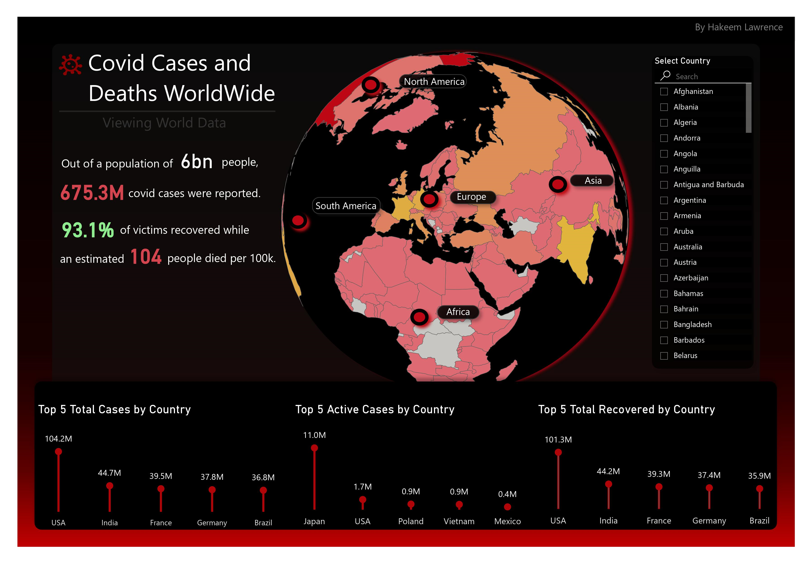

# Covid 19 Outbreak Analysis
By Hakeem Lawrence, Business Intelligence Engineer  
Challenge Provider : Data In Motion LLC  
Technology : Power BI  
NovyPro Report : [Covid Cases Report](https://www.novypro.com/project/covid-19-3)

### Data Source : [Covid Cases Dataset Here](https://www.kaggle.com/datasets/themrityunjaypathak/covid-cases-and-deaths-worldwide)
The data set was provided by the World Health Organization (WHO) and is available on Kaggle. The data set contains daily COVID-19 case and death counts for each country and region. 

### Background
The COVID-19 outbreak, caused by the novel coronavirus SARS-CoV-2, emerged in late 2019 and quickly escalated into a global pandemic. Characterized by respiratory symptoms, it spread rapidly through human-to-human transmission. Governments worldwide implemented various measures such as lockdowns, travel restrictions, and social distancing to contain its spread and mitigate its impact on healthcare systems. The pandemic led to profound disruptions in economies, education, and daily life, affecting millions of people worldwide. Vaccination efforts and advancements in medical treatments have been crucial in combating the virus, but the outbreak's long-term implications on public health and societal norms continue to be a subject of ongoing research and concern.

## The Assignment
This data viz challenge allowed the analyst to use whatever techniques they felt were appropriate to answer the questions below.  
1. Is there any missing data? If so, perform missing data treatment of your choice.
2. What are the data types? Looks like most of the numeric columns need to be changed. Convert them to floats and integers as necessary.
3. How many different countries had the virus?
4. Create a geographical plot of the distribution of deaths from around the world.
5. What are the top 5 countries in active cases?
6. What are the top 5 countries in total recoveries?

## My Approach

### The Layout
The focal point of this report was the geographical sphere. The map was strategically placed into the center of the report as the biggest element to draw attention there. This way, the user can quickly see the distribution of deaths around the world. The map is also conditionally formatted to change based on the user's selection. So, if the user selects a country, the map will highlight the selected regions while leaving the others white. I found this as a great way to draw attention to the selected regions without forcing the user to look very hard for it. 

### The Color Scheme
A red and black color scheme seemed to be the most fitting for this report. Metaphorically speaking, the red color is used to represent the virus and the black color is used to represent death. Combining the two helps to create a sense of urgency and seriousness. These colors play a big role in the overall theme of the report because they set the tone for the user. 

### The Message
The dynamic message to the left of the map was created with custom DAX formulas, allowing the user to see aggregated values relating to the selected regions. The message is also conditionally formatted to change colors based on recovery rates. This way, the user can quickly see the recovery rate of the selected regions.

### The Interactivity

A slicer was added to the right as a panel of the report to give the user the option to either select all regions or a specific region. This slicer is connected to the map and the message, allowing the user filter the entire model at will.
   

# Conclusion

My biggest focus here was taking advantage of design principles to communicate the summary of this data in the most effective way possible. By combining the right colors, shapes, and sizes, I was able to create a report that is both visually appealing and informative.
